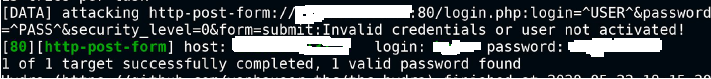

# Dictionary-Attack-with-Burp-Suite-Hydra-and-ZAProxy
How to perform a dictionary attack with Burp Suite, Hydra and ZAProxy? Let's see  
I show only the important steps required to perform the attack, so, I didn’t explain everything.
# Introduction of the tools
## Burp Suite
Burp Suite is a platform for web application security testing, vulnerability scanning, and penetration testing. It is written in Java and developed by PortSwigger, a company founded by Dafydd Stuttard. Burp Suite helps to identify and validate vulnerabilities and attack vectors that affect web applications. It is widely used by security professionals and penetration testers to evaluate the security of web applications.
 
Burp Suite provides various features and tools for web security testing, such as: 
- Burp Proxy: an intercepting proxy that allows you to modify and analyze HTTP(S) and WebSocket traffic between your browser and the target application. 
- Burp Scanner: an automated web vulnerability scanner that performs crawling and scanning of web applications to find common and complex vulnerabilities. 
- Burp Repeater: a tool that allows you to manually send and modify individual HTTP(S) requests and view the responses. 
- Burp Intruder: a tool that allows you to automate custom attacks on web applications by sending multiple variations of HTTP(S) requests and analyzing the responses. 
- Burp Decoder: a tool that allows you to decode and encode data using various methods, such as URL encoding, Base64, hex, etc. 
- Burp Comparer: a tool that allows you to compare two pieces of data to find differences or similarities. 
- Burp Sequencer: a tool that allows you to analyze the randomness and entropy of session tokens and other data. 
- Burp Collaborator: a service that allows you to perform out-of-band testing and discover server-side vulnerabilities that are not visible in the application’s responses. 
- Burp Extender: a feature that allows you to extend the functionality of Burp Suite by using BApp extensions and a powerful API.  
Burp Suite is available in two editions: Community and Professional. The Community edition is free and provides the essential manual toolkit for learning about web security testing. The Professional edition is paid and provides faster, more reliable, and more customizable security testing for AppSec professionals 
 

## Hydra
Hydra is a tool for pentesting that allows you to perform brute-force attacks on various network services and protocols. It is very fast and flexible, and you can add new modules easily. Hydra can help you to test the security of web applications, databases, mail servers, and more by trying different combinations of usernames and passwords until it finds a valid one. Hydra is part of the Kali Linux distribution, which is a popular operating system for penetration testing and ethical hacking. Hydra can also work with other tools and extensions to enhance its functionality and perform more advanced attacks. Hydra is widely used by security professionals and researchers to evaluate the security of network systems and discover vulnerabilities. 
 
## ZAProxy
ZAProxy is a web application security testing tool that can help you find and fix vulnerabilities in your web applications. It is free and open source, and it is maintained by a dedicated international team of volunteers. ZAProxy can be used to scan web applications for common security issues, such as SQL injection, cross-site scripting, broken authentication, and more. It can also be used to intercept and modify web traffic, perform active and passive scanning, spider web applications, and generate reports.
 
ZAProxy is designed to be easy to use, even for people who are new to security testing. It has a graphical user interface, a command-line interface, and a web interface. It also supports various automation options, such as scripting, API, and Docker . ZAProxy can be extended with add-ons that provide additional functionality, such as fuzzing, authentication, and AJAX support.
 
  
## Dictionary Attack with Burp Suite
We perform the attack on bWAPP.  
### Goal: Get the credentials and access the bWAPP/basic directory.  
Use nmap to scan the network and identify the ports that are running the http and mysql services. The ports must be OPEN. 
1) In the Browser turn on foxy proxy and open the Burp Suite App 
2) Insert random credentials to intercept the http request GET on Burp and send it to the intruder. In Positions tab u can select the Payload for decode it (check the type of decoding). 
 
3) Use the add button to replace the credentials in the http request with a parameter 
 
4) Navigate to the Payloads tab and load the wordlist of passwords. In Payload Processing, add the Prefix "admin:" and the encoding option 
5) Click the button <b>Start attack!</b>  

If your wordlist matches, u will get the status code 200 or 301, check the response and send it to the decoder. Finaly, u can decode the payload to have explicit credentials.  
 

## Dictionary Attack with Hydra
We perform the attack on bWAPP.  
### Goal: Get the credentials.  
Use nmap to scan the network and identify the ports that are running the http and mysql services. The ports must be OPEN.
We need the username and password variables to perform dictionary attack with Hydra.  
1) Analyze the html page to search the variables and create two files, one with usernames and one with the passwords.
 
 
2) Perform the attack, (placeholder will take the value from the wordlist)  
Use the command: - hydra -L "<b>wordlist_username</b>" -P "<b>wordlist_password</b>" "<b>ip-webapp</b>" http-post-form "/login.php:login=<b>^USER^</b>&password=<b>^PASS^</b>&security_level=0&form=submit:Invalid!"  
If something matches, u will get a valid password.  
 

## Dictionary Attack with ZAProxy
We perform the attack on bWAPP.  
### Goal: Get the credentials.  
Use nmap to scan the network and identify the ports that are running the http and mysql services. The ports must be OPEN. 
1) Launch owasp ZAP application and insert random credentials to the login form to get the http request. 
2) Navigate to the directory js in sites tab and <b>click on the http POST request -> right click-> attack -> fuzzer.</b> 
 
3) Select the value of the login variable and click the add button to add your personal wordlist 
4) Select the value of the password variable and click the add button to add your personal wordlist 
5) <b>Click Start Fuzzer</b>
 
If something matches, u will get a status code 200 or 302, the credentials are in the payload column. 
 

#Author
<b>Xiao Li Savio Feng</b>
